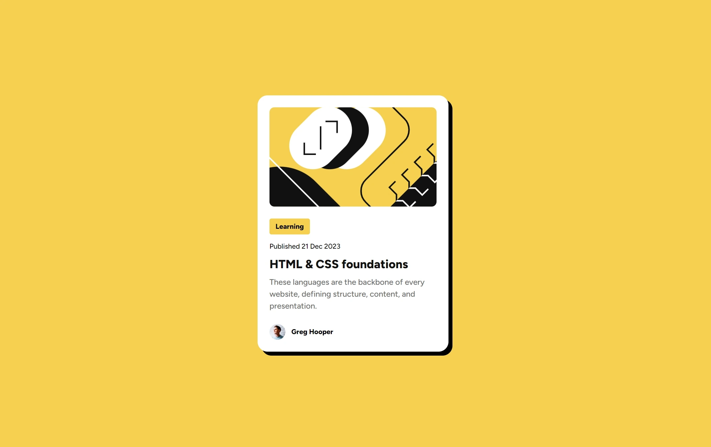

# Frontend Mentor - Blog preview card solution

This is my solution to the [Blog preview card challenge on Frontend Mentor](https://www.frontendmentor.io/challenges/blog-preview-card-ckPaj01IcS).

## Table of contents

- [Overview](#overview)
  - [Screenshot](#screenshot)
- [My process](#my-process)
  - [Built with](#built-with)
  - [Continued development](#continued-development)
- [Author](#author)

## Overview

### Screenshot

#### Desktop View | Mobile View

 

#### Desktop View - Hover State

## My process

### Built with

- Semantic HTML5 markup
- CSS custom properties
- Flexbox

### Continued development

- Edit Profile Image and Name
- Edit text and update the timedate

## Author

- Website - [Hunafa Zaky](https://hunafazaky.github.io/)
- Frontend Mentor - [@hunafazaky](https://www.frontendmentor.io/profile/hunafazaky)
